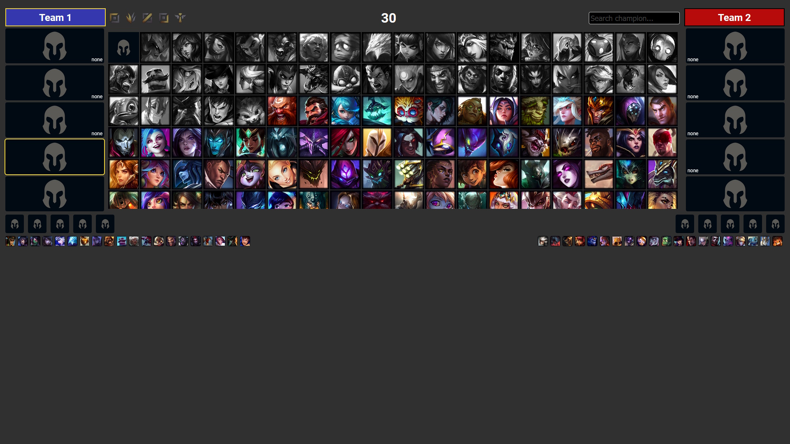
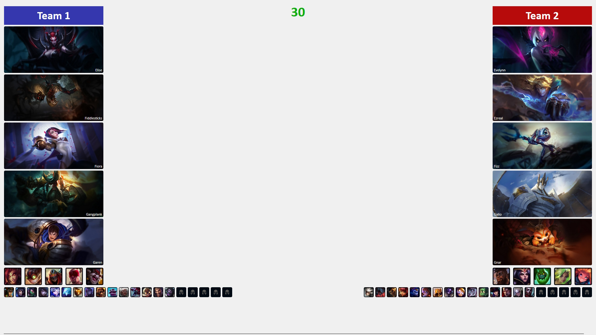
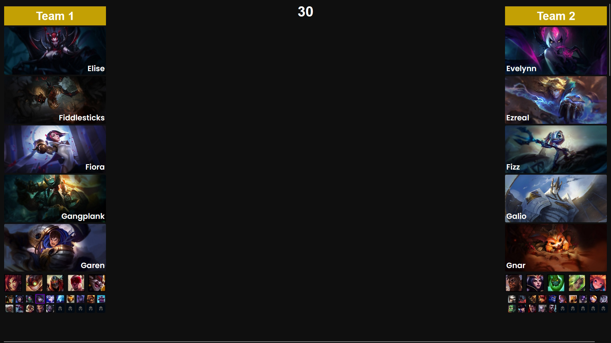
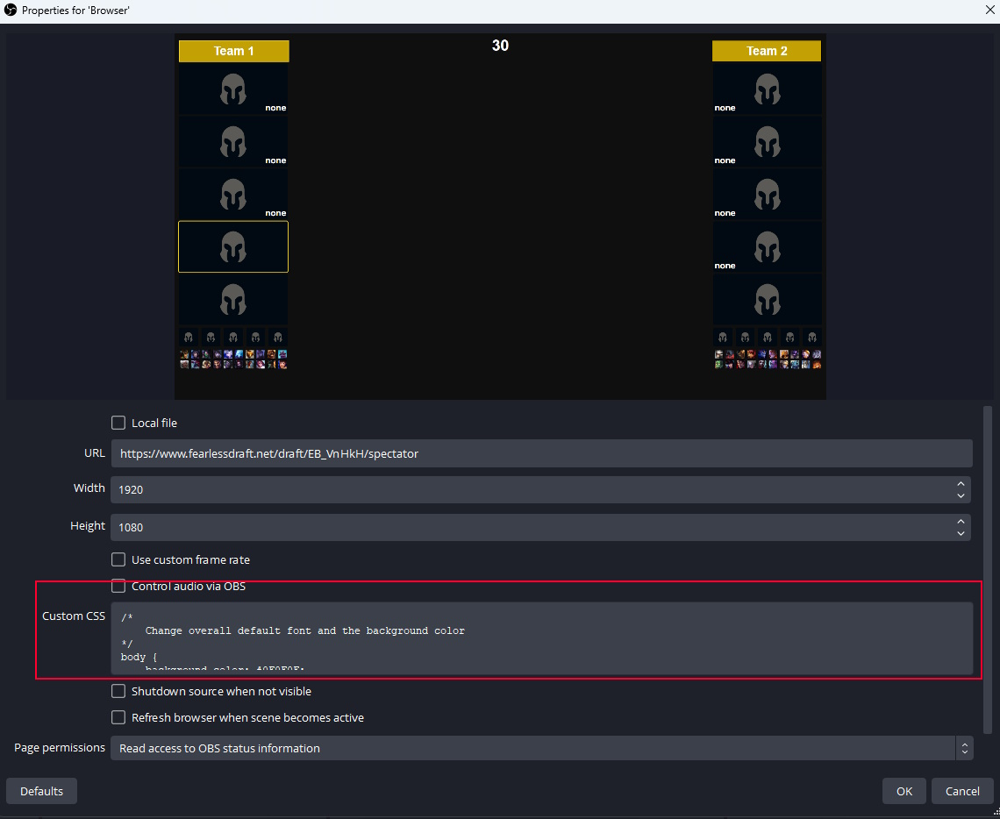

# OBS / VMix CSS Injection 
This repository contains example **CSS** code injections that can be used in OBS, VMix, or even generic browsers, to change the way https://www.fearlessdraft.net/ looks. This is mostly useful for customizing the fearless draft UI for the purpose of broadcasts and livestreams.

Here is what fearlessdraft.net looks like originally:

Here is what it looks like with the CSS injection from `draft1.css` and `draft2.css`:
 
Note that in example 2, it's possible to make the fearless draft bans wrap around. 

## Using the CSS Injection 
### OBS and VMix
`draft1.css` and `draft2.css` are just examples/templates. To use them, open the file on this GitHub page, or in a text editor. Then, copy all their contents, and paste it into the "Custom CSS" entry box of an OBS Browser Source. 

You should see fearlessdraft.net appear with the custom CSS applied. 

I don't actually use VMix, but there should be a similar custom CSS field in a browser input on VMix. 

### Editing in a Browser
If you plan on changing UI margins and spacing and padding, I would recommend doing so using the Inspect Element tool within a web browser, which will offer you finer control compared to trying to do manually changing values in OBS.

In an active [fearlessdraft.net](https://www.fearlessdraft.net/draft/EB_VnHkH/spectator) draft open on your browser of choice, you can press `F12` to open Inspect Element. Then, you can copy + paste the entirety of the CSS injection into the `Styles` or `CSS` tab of the web page, which will overwrite the CSS. If using the example CSS, you might have to uncommment the extra unused CSS classes at the very bottom of the file. 

You can fiddle around and dial in the exact size and margin and color values you'd like, then when you're done, copy+paste the same code you've been writing in `Styles` or `CSS` back into OBS/VMix to update your show.